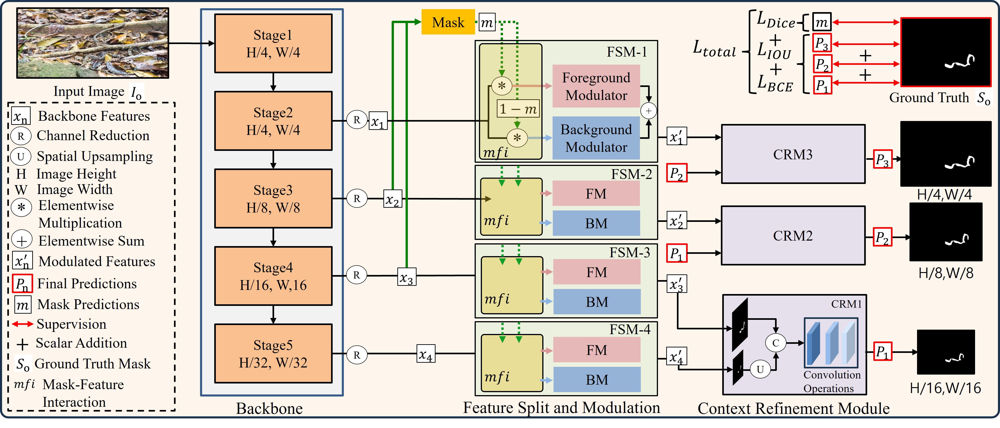
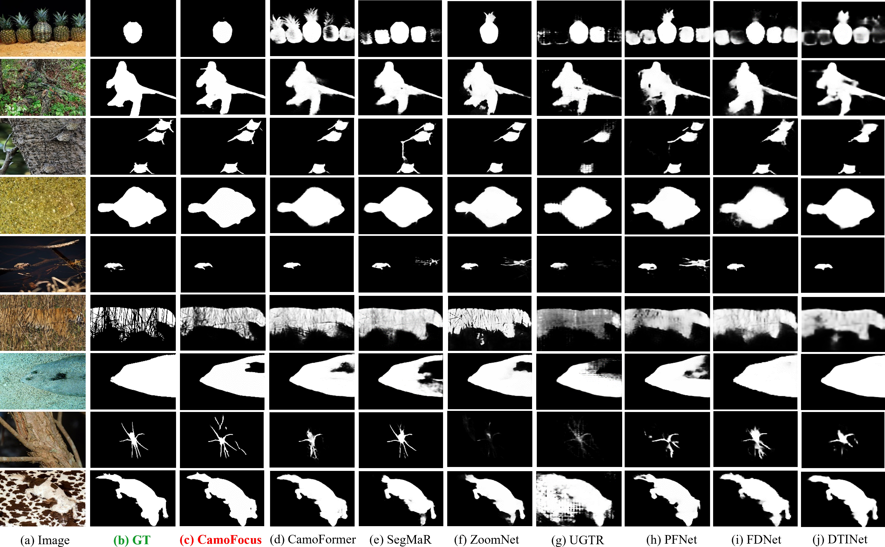

<div align="center">

<h1>CamoFocus</h1>

<h3>Enhancing Camouflage Object Detection with Split-Feature Focal Modulation and Context Refinement</h3>

<p>
  <a href="https://doi.org/10.1109/WACV57701.2024.00146">
    
  </a>
  <a href="https://ieeexplore.ieee.org/document/10483928">
    
  </a>
  
  
</p>

<p>
  <strong>Abbas Khan<sup>1</sup>, Mustaqeem Khan<sup>1</sup>, Wail Gueaieb<sup>1,2</sup>, Abdulmotaleb El Saddik<sup>1,2</sup>, Giulia De Masi<sup>3</sup>, Fakhri Karray<sup>1,4</sup></strong>
</p>

<p>
  <sup>1</sup>MBZUAI, UAE &nbsp;|&nbsp;
  <sup>2</sup>University of Ottawa, Canada &nbsp;|&nbsp;
  <sup>3</sup>Technology Innovation Institute, UAE
</p>

</div>

---

## Overview

Camouflage Object Detection (COD) involves isolating a target object that blends seamlessly into its background — a task that remains a formidable challenge for learning algorithms due to low contrast, similar textures, and obscure object boundaries.

**CamoFocus** tackles this by drawing inspiration from Focal Modulation Networks. Rather than treating the scene as a uniform feature map, CamoFocus explicitly decouples foreground and background components and modulates them independently, forcing the model to learn the distinctive characteristics of each.

<div align="center">
  
  <p><em>Overall architecture of CamoFocus. The network uses a PVT-v2-B4 backbone, with the FSM and CRM modules driving feature refinement.</em></p>
</div>

---

## Key Contributions

**1. Feature Split and Modulation (FSM)**
The FSM module separates the input feature map into foreground and background streams using a supervisory mask from the Edge Attention Module (EAM). Each stream is passed through independent focal modulation layers that capture context at multiple receptive field scales, allowing the model to model the distinct statistics of camouflaged objects versus their surroundings. The two streams are recombined with learnable blend weights.

**2. Context Refinement Module (CRM)**
The CRM serves as the top-down decoder. It aggregates the multi-scale features produced by FSM across all four pyramid levels using grouped dilated convolutions at progressively larger dilation rates (4, 6, 8). This enriches spatial context comprehensively and yields highly accurate, boundary-aware prediction maps.

---

## Architecture

```
Input Image (416 × 416)
       │
  PVT-v2-B4 Backbone
  ┌────┴────────────────────┐
  x1 (64ch)  x2 (128ch)  x3 (320ch)  x4 (512ch)
       │
  Channel Reduction (Conv1x1)
  ┌────┴────────────────────┐
  x1r (64)  x2r (128)  x3r (256)  x4r (256)
                │
           EAM (x3r, x2r)
                │
            mask (foreground prob.)
                │
    ┌───────────┴───────────┐
    FSM — focal modulation guided by mask
    ┌────┴────────────────────┐
    x1r′  x2r′  x3r′  x4r′
                │
    CRM — top-down decoder
    x34  ←  CRM(x3r′, x4r′)
    x234 ←  CRM(x2r′, x34)
    x1234 ← CRM(x1r′, x234)
                │
    ┌───────────┴────────────┐
    o3 (×16)  o2 (×8)  o1 (×4)  mask (×8)
```

---

## Qualitative Results

<div align="center">
  
  <p><em>Qualitative comparison of CamoFocus against recent SOTA methods on CAMO, COD10K, CHAMELEON, and NC4K. CamoFocus produces sharper, more complete predictions especially near object boundaries.</em></p>
</div>

---

## Quantitative Results
 
CamoFocus is evaluated on four standard COD benchmarks using five metrics: structure measure (S<sub>m</sub>↑), adaptive E-measure (αE↑), weighted F-measure (F<sup>w</sup><sub>β</sub>↑), F-measure (F<sub>β</sub>↑), and mean absolute error (M↓).
 
CamoFocus is offered in three variants:
- **CamoFocus-R** — ResNet-based backbone
- **CamoFocus-E1** — efficient variant
- **CamoFocus-P2** — PVT-v2-B4 backbone (best performance)
### Convolution-Based Methods
 
| Method | NC4K S<sub>m</sub>↑ | NC4K αE↑ | NC4K F<sup>w</sup><sub>β</sub>↑ | NC4K F<sub>β</sub>↑ | NC4K M↓ | COD10K S<sub>m</sub>↑ | COD10K αE↑ | COD10K F<sup>w</sup><sub>β</sub>↑ | COD10K F<sub>β</sub>↑ | COD10K M↓ | CHAME. S<sub>m</sub>↑ | CHAME. αE↑ | CHAME. F<sup>w</sup><sub>β</sub>↑ | CHAME. F<sub>β</sub>↑ | CHAME. M↓ | CAMO S<sub>m</sub>↑ | CAMO αE↑ | CAMO F<sup>w</sup><sub>β</sub>↑ | CAMO F<sub>β</sub>↑ | CAMO M↓ |
|--------|:-:|:-:|:-:|:-:|:-:|:-:|:-:|:-:|:-:|:-:|:-:|:-:|:-:|:-:|:-:|:-:|:-:|:-:|:-:|:-:|
| SINet-v2 | 0.808 | 0.883 | 0.723 | 0.769 | 0.058 | 0.776 | 0.867 | 0.631 | — | 0.043 | 0.872 | 0.938 | 0.806 | — | 0.034 | 0.745 | 0.825 | 0.644 | — | 0.092 |
| MGL-R | 0.833 | 0.867 | 0.740 | 0.782 | 0.052 | 0.814 | 0.865 | 0.666 | — | 0.035 | 0.893 | 0.923 | 0.812 | — | 0.031 | 0.775 | 0.848 | 0.673 | — | 0.088 |
| C2FNet-R2 | 0.838 | 0.901 | 0.762 | 0.795 | 0.049 | 0.813 | 0.886 | 0.686 | — | 0.036 | 0.888 | 0.932 | 0.828 | — | 0.032 | 0.796 | 0.864 | 0.719 | — | 0.080 |
| UGTR-R | 0.839 | 0.889 | 0.747 | 0.787 | 0.052 | 0.818 | 0.850 | 0.667 | — | 0.035 | 0.888 | 0.921 | 0.794 | — | 0.031 | 0.784 | 0.859 | 0.794 | — | 0.086 |
| PFNet-R | 0.829 | 0.894 | 0.745 | 0.784 | 0.053 | 0.800 | 0.868 | 0.660 | — | 0.040 | 0.882 | 0.942 | 0.810 | — | 0.033 | 0.782 | 0.852 | 0.695 | — | 0.085 |
| PreyNet-R | — | — | — | — | — | 0.813 | 0.894 | 0.697 | — | 0.034 | 0.902 | 0.951 | 0.856 | 0.866 | 0.027 | 0.790 | 0.854 | 0.708 | 0.763 | 0.077 |
| BSANet-R2 | — | — | — | — | — | 0.818 | 0.894 | 0.699 | — | 0.034 | 0.895 | 0.946 | 0.841 | — | 0.027 | 0.769 | 0.851 | 0.717 | — | 0.079 |
| ZoomNet-R | 0.853 | 0.907 | 0.784 | 0.818 | 0.043 | 0.838 | 0.893 | 0.729 | — | 0.029 | 0.902 | 0.952 | 0.845 | — | 0.023 | 0.820 | 0.883 | 0.752 | — | 0.066 |
| FDNet-R2 | 0.834 | 0.895 | 0.750 | — | 0.052 | 0.837 | 0.897 | 0.731 | — | 0.030 | 0.894 | 0.948 | 0.819 | — | 0.030 | 0.844 | 0.903 | 0.778 | — | 0.062 |
| OCENet-R | 0.857 | 0.899 | — | 0.817 | 0.044 | 0.832 | 0.890 | — | 0.745 | 0.032 | 0.901 | 0.940 | — | 0.843 | 0.028 | 0.802 | 0.866 | — | 0.767 | 0.075 |
| SegMar-R | 0.841 | 0.905 | 0.781 | — | 0.046 | 0.833 | 0.895 | 0.724 | — | 0.033 | 0.897 | 0.950 | 0.835 | — | 0.027 | 0.815 | 0.872 | 0.742 | — | 0.071 |
| MFFN-R2 | 0.856 | 0.915 | 0.791 | 0.827 | 0.042 | 0.846 | 0.917 | 0.745 | — | 0.028 | 0.905 | 0.963 | 0.852 | — | 0.021 | — | — | — | — | — |
| PopNet | 0.852 | 0.908 | 0.852 | — | 0.043 | 0.851 | 0.910 | 0.757 | — | 0.028 | 0.910 | 0.962 | 0.893 | — | 0.022 | 0.808 | 0.871 | 0.744 | — | 0.077 |
| CamoFormer-R | 0.857 | 0.915 | 0.793 | — | 0.024 | 0.838 | 0.898 | 0.730 | — | 0.029 | 0.900 | 0.949 | 0.843 | — | 0.024 | 0.817 | 0.884 | 0.756 | — | 0.066 |
| DGNet-E4 | 0.857 | 0.910 | 0.784 | — | 0.042 | 0.822 | 0.879 | 0.693 | — | 0.033 | 0.890 | 0.934 | 0.816 | — | 0.029 | 0.839 | 0.901 | 0.769 | — | 0.057 |
| **CamoFocus-R** | **0.847** | **0.910** | **0.788** | **0.812** | **0.043** | **0.825** | **0.903** | **0.719** | **0.749** | **0.033** | **0.898** | **0.953** | **0.849** | **0.859** | **0.027** | **0.812** | **0.873** | **0.752** | **0.794** | **0.071** |
| **CamoFocus-E1** | **0.855** | **0.912** | **0.790** | **0.820** | **0.042** | **0.830** | **0.899** | **0.719** | **0.735** | **0.030** | **0.901** | **0.940** | **0.846** | **0.837** | **0.024** | **0.830** | **0.893** | **0.770** | **0.806** | **0.062** |
 
### Transformer-Based Methods
 
| Method | NC4K S<sub>m</sub>↑ | NC4K αE↑ | NC4K F<sup>w</sup><sub>β</sub>↑ | NC4K F<sub>β</sub>↑ | NC4K M↓ | COD10K S<sub>m</sub>↑ | COD10K αE↑ | COD10K F<sup>w</sup><sub>β</sub>↑ | COD10K F<sub>β</sub>↑ | COD10K M↓ | CHAME. S<sub>m</sub>↑ | CHAME. αE↑ | CHAME. F<sup>w</sup><sub>β</sub>↑ | CHAME. F<sub>β</sub>↑ | CHAME. M↓ | CAMO S<sub>m</sub>↑ | CAMO αE↑ | CAMO F<sup>w</sup><sub>β</sub>↑ | CAMO F<sub>β</sub>↑ | CAMO M↓ |
|--------|:-:|:-:|:-:|:-:|:-:|:-:|:-:|:-:|:-:|:-:|:-:|:-:|:-:|:-:|:-:|:-:|:-:|:-:|:-:|:-:|
| VST-T | 0.830 | 0.887 | 0.740 | — | 0.053 | 0.810 | 0.866 | 0.680 | — | 0.035 | 0.888 | 0.936 | 0.820 | — | 0.033 | 0.805 | 0.863 | 0.780 | — | 0.069 |
| COS-T | 0.825 | 0.881 | 0.730 | — | 0.055 | 0.790 | 0.901 | 0.693 | — | 0.035 | 0.885 | 0.948 | 0.854 | — | 0.025 | 0.813 | 0.896 | 0.776 | — | 0.060 |
| DTINet-T | 0.863 | 0.915 | 0.792 | — | 0.041 | 0.824 | 0.893 | 0.695 | — | 0.034 | 0.883 | 0.928 | 0.813 | — | 0.033 | 0.857 | 0.912 | 0.796 | — | 0.050 |
| CamoFormer-P33 | 0.892 | 0.931 | 0.847 | — | 0.030 | 0.869 | 0.931 | 0.786 | — | 0.023 | 0.910 | 0.970 | 0.865 | — | 0.022 | 0.872 | 0.931 | 0.813 | — | 0.046 |
| **CamoFocus-P2** | **0.889** | **0.936** | **0.853** | **0.870** | **0.030** | **0.873** | **0.935** | **0.802** | **0.818** | **0.021** | **0.912** | **0.957** | **0.876** | **0.884** | **0.023** | **0.873** | **0.926** | **0.842** | **0.861** | **0.043** |
 
---

## Repository Structure

```
CamoFocus/
├── net/
│   ├── network.py          # Main model: Network (FSM + CRM + EAM)
│   ├── pvtv2_encoder.py    # PVT-v2-B4 backbone
│   ├── ResNet.py           # ResNet backbone (alternative)
│   └── Res2Net.py          # Res2Net backbone (alternative)
├── utils/
│   ├── tdataloader.py      # Training data loader
│   └── utils.py            # Helpers: clip_gradient, AvgMeter, poly_lr
├── train.py                # Training script
├── test.py                 # Inference / evaluation script
├── Examples/               # Sample qualitative results
├── models/                 # Pretrained backbone weights (download separately)
├── checkpoints/            # Saved model checkpoints
├── log/                    # Training logs
└── README.md
```

---

## Installation

```bash
# 1. Clone the repository
git clone https://github.com/<your-username>/CamoFocus.git
cd CamoFocus

# 2. Create and activate a virtual environment
conda create -n camofocus python=3.8 -y
conda activate camofocus

# 3. Install dependencies
pip install -r requirements.txt
```

**requirements.txt** should include:
```
torch>=1.9.0
torchvision>=0.10.0
timm
numpy
Pillow
```

---

## Datasets

Download the benchmark datasets and place them under `./data/`:

| Dataset | Images | Split | Link |
|---------|--------|-------|------|
| CHAMELEON | 76 | test only | [link](http://www.polsl.pl/rau6/chameleon-database-animal-camouflage-analysis/) |
| CAMO | 1,250 | 1,000 train / 250 test | [link](https://drive.google.com/drive/folders/1h-OqZdwkuPhBvGcVAwmh0f1NGqlH_4B6) |
| COD10K | 5,066 | 3,040 train / 2,026 test | [link](https://dengpingfan.github.io/pages/COD.html) |
| NC4K | 4,121 | test only | [link](https://github.com/JingZhang617/COD-Rank-Localize-and-Segment) |

Training uses **4,040 images** combined from CAMO (1,000) and COD10K (3,040).

Expected directory structure:
```
data/
├── TrainDataset/
│   ├── Imgs/
│   ├── GT/
│  
└── TestDataset/
    ├── CHAMELEON/
    ├── CAMO/
    ├── COD10K/
    └── NC4K/
```

---

## Pretrained Weights

Download the PVT-v2-B4 ImageNet pretrained backbone and place it at `./models/pvt_v2_b4.pth`:

| File | Description | Link |
|------|-------------|------|
| `pvt_v2_b4.pth` | PVT-v2-B4 ImageNet weights | [Google Drive](#) |
| `CamoFocus.pth` | CamoFocus trained checkpoint | [Google Drive](#) |

---

## Training

```bash
python train.py \
  --train_path ./data/TrainDataset \
  --epoch 90 \
  --batchsize 24 \
  --trainsize 416 \
  --lr 1e-4 \
  --train_save CamoFocus
```

Checkpoints are saved every 30 epochs to `checkpoints/CamoFocus/`. Training logs are written to `log/BGNet.txt`.

---

## Inference

```bash
python test.py \
  --checkpoint ./checkpoints/CamoFocus/CamoFocus.pth \
  --test_path ./data/TestDataset \
  --save_path ./results/
```

---

## Citation

If you find this work useful, please consider citing:

```bibtex
@inproceedings{khan2024camofocus,
  title     = {CamoFocus: Enhancing Camouflage Object Detection with Split-Feature
               Focal Modulation and Context Refinement},
  author    = {Khan, Abbas and Khan, Mustaqeem and Gueaieb, Wail and
               El Saddik, Abdulmotaleb and De Masi, Giulia and Karray, Fakhri},
  booktitle = {Proceedings of the IEEE/CVF Winter Conference on Applications
               of Computer Vision (WACV)},
  pages     = {1434--1443},
  year      = {2024}
}
```

---

## Acknowledgements

This work was carried out at **MBZUAI (Mohamed Bin Zayed University of Artificial Intelligence)**, UAE, in collaboration with the University of Ottawa and the Technology Innovation Institute.

We thank the authors of [PVT-v2](https://github.com/whai362/PVT), [Focal Modulation Networks](https://github.com/microsoft/FocalNet), and the COD benchmark datasets ([COD10K](https://dengpingfan.github.io/pages/COD.html), [CAMO](https://drive.google.com/drive/folders/1h-OqZdwkuPhBvGcVAwmh0f1NGqlH_4B6), [NC4K](https://github.com/JingZhang617/COD-Rank-Localize-and-Segment)) for making their code and data publicly available.

---

<div align="center">
  <sub>WACV 2024 · IEEE/CVF Winter Conference on Applications of Computer Vision · pp. 1434–1443</sub>
</div>
